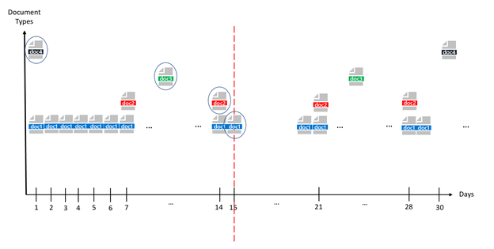
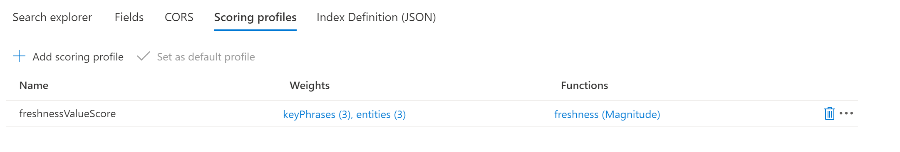
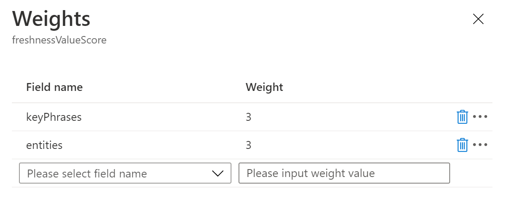
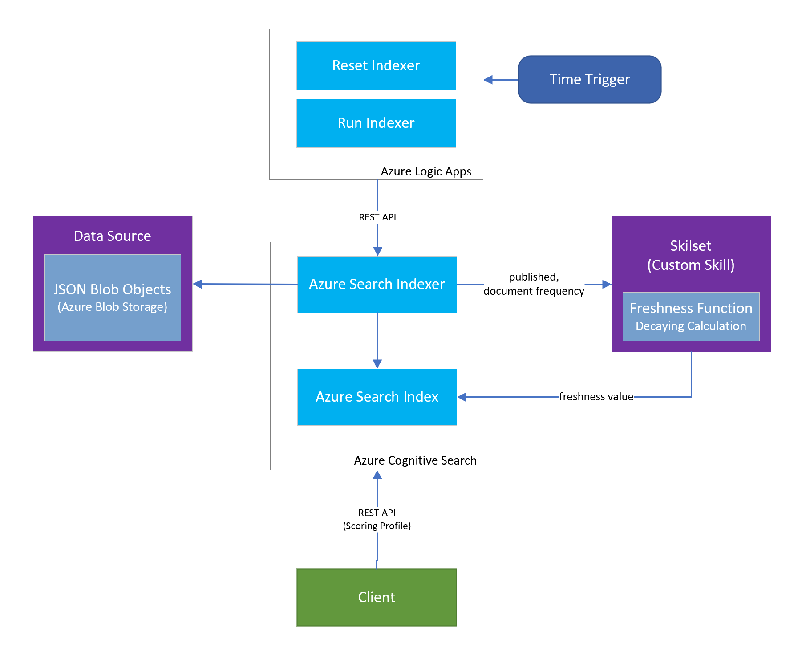
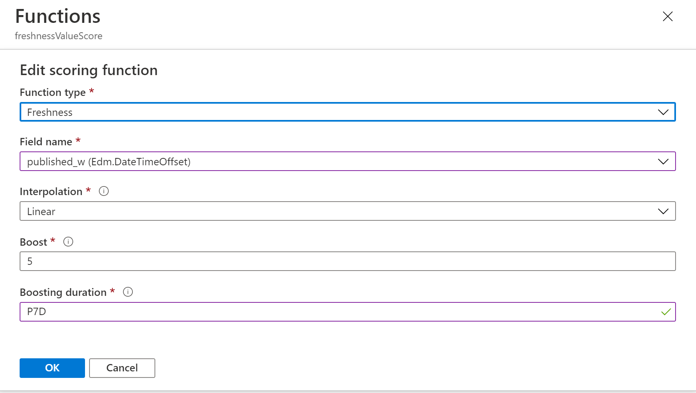
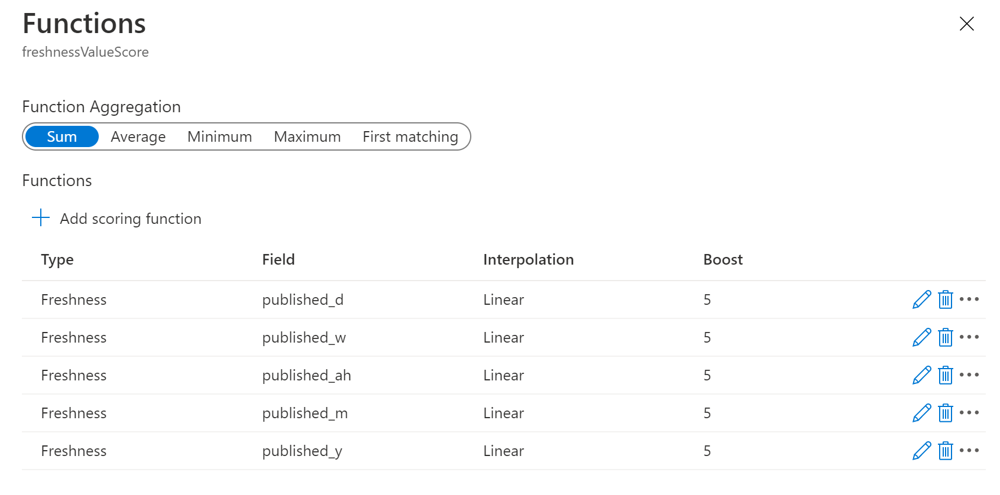
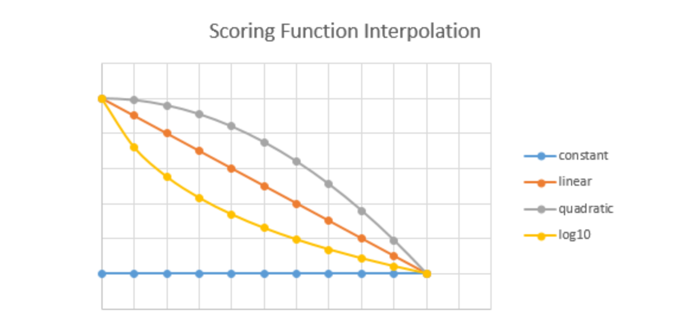

# Freshness and Boosting for Azure Cognitive Search

Azure Services

| NAME              | TYPE                 | LOCATION    |
| ----------------- | -------------------- | ----------- |
| enrichdocument    | Cognitive Services   | West Europe |
| freshnessboosting | Application Insights | West Europe |
| freshnessboosting | Storage account      | West Europe |
| freshnessboosting | App Service          | West Europe |
| freshnesstrigger  | Logic app            | West Europe |
| searchboosting    | Search service       | West Europe |
| searchboosting    | Storage account      | West Europe |
| WestEuropePlan    | App Service plan     | West Europe |

## I.          Documents with different publish frequencies

Information retrieval systems provide relevant content to users based on their queries. Relevancy in our case the most recent documents with query matches in index base, “recent documents” depends on document types, these document types have different publish frequencies. There are some documents with “Daily”, “Weekly”, “Bi-weekly", “Monthly”, “Yearly” publish frequencies.

We identify these recent documents term as “Freshness”. We are aiming to retrieve freshest content based on document publish frequency. 

The main difficulty we are trying to solve here is, considering all fresh documents per document types and rank them in an aggregated list. Frequent documents age quickly comparing to less frequent documents, daily documents will not be fresh once there is a new document a day later, however monthly document will be still fresh until next month in 30days. All new documents from different frequency types will be treated in same way. 

Let’s take *“Figure 1. Document Type Distribution”* as an example, 

·    **“doc1”** represent **“daily”** document types,

·    **“doc2”** represent **“weekly”** document types

·    **“doc3”** represent **“bi-weekly”** document types

·    **“doc4”** represent **“monthly”** document types

In this case after receiving relevant results, it is hard to order by their dates due to their variety of publish frequencies.

Let’s take Day 15 on the graph as a reference for freshness, documents in circles are freshest content in their own document types based on their publish frequencies. 15 days old monthly doc4 document is still freshest, 5 days old bi-weekly doc3 is freshest, 1-day old weekly doc2 is freshest, published on the same day doc1 is freshest in its own frequency category.



# Boosting Techniques

### a.    Using query keyword matches to boost documents

A scoring profile is part of the index definition, composed of weighted fields, functions, and parameters. We are using scoring profile to boost documents using terms and datetime value to retrieve more relevant score at top rankings.

Scoring profiles are visible at index level at Azure Portal and you can adjust values due to your needs.



In our case for Scoring Profile, we have used a mix of field weights and scoring functions. Field weights are available based on our research and we’ve assigned different weights for 3 different fields.

**“keyPhrases”** boosting by **3**

**“namedEntities”** boosting by **3**



These ‘**weights**’ mean whenever there’s a match with user query and selected fields then our selected documents will be boosted and “search.score”s will increase based on these matches.

Alternatively, you can create the profile as part of [index definition](https://docs.microsoft.com/en-us/azure/search/index-add-scoring-profiles)

Azure Cognitive Search scoring profile can be set like below in query.

Turkey&$count=true&$select=id,title,published&scoringProfile=freshnessValueScore

### b.   Freshness Calculation

Scoring Functions are used when additional calculations are required for specific contexts. Valid values are freshness, magnitude, distance, and tag. Each function has parameters that are unique to it. In our case we have implemented a numeric Freshness Value using ***magnitude\*** boosting, then we had an experiment with built-in ***freshness\*** boosting.

We will deep dive into using numeric freshness value for boosting and boosting freshness with multiple fields.

#### 1.    Using a numeric freshness value to boost documents

In first approach we have provided a double type field called “**freshness**” in our index. This field is calculated by Azure Functions using decaying calculation function. Decaying Function helps us to find a numeric value based on age of the document and document type. After that we are using this double value to boost our documents.


**Decaying Function**

The decaying functions are designed for publication frequency. It gives different weights for different publication frequencies according to its age, which is the number of days since documents have been published (hour can also be regarded as a unit). For example, if we count the age by day, then documents published daily will be weighted 0.5 one day after its publishing date, and 0.25 the second day after its publishing date. You can see how decaying function is working for different document frequencies in “*Table 1. Freshness value effect on each day per document frequency”*

| Days      | 0      | 1      | 2      | 3      | 4      | 5      | 6      | 7      | 8      | 9      | 10     | 11     | 12     | 13     | 14     | 15     |
| --------- | ------ | ------ | ------ | ------ | ------ | ------ | ------ | ------ | ------ | ------ | ------ | ------ | ------ | ------ | ------ | ------ |
| Daily     | 1.0000 | 0.0000 | 0.0000 | 0.0000 | 0.0000 | 0.0000 | 0.0000 | 0.0000 | 0.0000 | 0.0000 | 0.0000 | 0.0000 | 0.0000 | 0.0000 | 0.0000 | 0.0000 |
| Weekly    | 1.0000 | 0.8571 | 0.7143 | 0.5714 | 0.4286 | 0.2857 | 0.1429 | 0.0000 | 0.0000 | 0.0000 | 0.0000 | 0.0000 | 0.0000 | 0.0000 | 0.0000 | 0.0000 |
| BiWeekly  | 1.0000 | 0.9286 | 0.8571 | 0.7857 | 0.7143 | 0.6429 | 0.5714 | 0.5000 | 0.4286 | 0.3571 | 0.2857 | 0.2143 | 0.1429 | 0.0714 | 0.0000 | 0.0000 |
| Monthly   | 1.0000 | 0.9667 | 0.9333 | 0.9000 | 0.8667 | 0.8333 | 0.8000 | 0.7667 | 0.7333 | 0.7000 | 0.6667 | 0.6333 | 0.6000 | 0.5667 | 0.5333 | 0.5000 |
| Quarterly | 1.0000 | 0.9889 | 0.9778 | 0.9667 | 0.9556 | 0.9444 | 0.9333 | 0.9222 | 0.9111 | 0.9000 | 0.8889 | 0.8778 | 0.8667 | 0.8556 | 0.8444 | 0.8333 |
| Yearly    | 1.0000 | 0.9973 | 0.9945 | 0.9918 | 0.9890 | 0.9863 | 0.9836 | 0.9808 | 0.9781 | 0.9753 | 0.9726 | 0.9699 | 0.9671 | 0.9644 | 0.9616 | 0.9589 |

*Table* *1. Freshness value effect on each day per document frequency*

 

Formula: 

>  Freshness value = 1 - (Day Difference / Document Frequency)

Code:

```java
// publishDate - publishdate of the content object document
// documentFrequency - Total Day value for Frequency of document e.g. Daily = 1, Weekly = 7 etc.
public double decayingFunction(Date publishDate, int documentFrequency){
    int numberOfDaysOld = Days.daysBetween(new DateTime(publishDate).toLocalDate(),DateTime.now().toLocalDate()).getDays();
    double value = 1.0 - ((double)numberOfDaysOld / (double)documentFrequency);
    if (value<0){
      return 0;
    }
    else{
      return value;
    }
  } 
```


 After applying formula above value representation in a graph looks like *“Graph 1. Representation of freshness value for document frequency”


*Graph 1. Representation of freshness value for document frequency*

Freshness value is a double value between 0 to 1 based on publish date and document frequency using the decaying function. The freshness of a document is defined as a custom skill in an Azure Function with Java and triggered by an indexer. 

The Azure Search Indexer is triggered every 24-hour and this trigger re-calculates the freshness value using “document frequency” and “publish date” of a document using decaying function.

To re-calculate all fields, we must reset the indexer and then run it again, that is why we need to send 2 http requests back to back. To perform this action, we have created an Azure Logic Apps to perform the reset and run to re-ingest/re-calculate all documents via skillset-custom skill. Architecture for trigger will look like *“Figure 1 - Freshness Flow”*



Figure 1 - Freshness Flow


#### 2.    Using datetime value to boost documents with a built-in freshness boost

For the second approach we have extended “published” datetime field for all document types. Based on the document type we have updated related field and set rest of the other fields as default. In Azure Search for default value you must provide a value, in our case we have provided “1900-01-01”. To provide these different fields we have defined 5 new fields in index definition and provided a logic in our data pipeline to generate these 5 new fields.


*“Table 2. Frequency distribution for multi date fields”* represent how we generate fields

| ***Frequency\*** | **published_d** | **published_w** | **published_ah** | **published_m** | **published_y** |
| ---------------- | --------------- | --------------- | ---------------- | --------------- | --------------- |
| *Daily*          | x               | default value   | default value    | default value   | default value   |
| *Weekly*         | default  value  | x               | default  value   | default  value  | default  value  |
| *Bi-Weekly*      | default value   | default value   | x                | default value   | default value   |
| *Monthly*        | default  value  | default  value  | default  value   | x               | default  value  |
| *Yearly*         | default value   | default value   | default value    | default value   | x               |

*Table 2. Frequency distribution for multi date fields*

A sample for (Bi-Weekly) document type

```json
…
  "published_d": "1900-01-01T00:00:00Z",
  "published_w": "1900-01-01T00:00:00Z",
  "published_ah": "2020-07-08T12:25:12Z",
  "published_m": "1900-01-01T00:00:00Z",
  "published_y": "1900-01-01T00:00:00Z"
…
```

As you see in above sample, we are generating 5 new fields based on document frequency, we’re setting exact value for related publish date field and leave rest as default value.

After generating these fields, we are using the built-in freshness function feature of Azure Cognitive Search.
 *freshness* should be used when we want to boost by how new or old an item is. This function can only be used with datetime fields (edm.DataTimeOffset). Notice the boostingDuration attribute is used only with the freshness function.



The main purpose of this approach is to add 5 built-in freshness function per datetime field and default values will not have any effect on boosting. If the actual date value is within “Boosting Duration”, documents will be boosted.



### b. Set interpolations

Interpolations allow us to set the shape of the slope used for scoring. Because scoring is high to low, the slope is always decreasing, but the interpolation determines the curve of the downward slope. The following interpolations can be used:



# Conclusion

The two freshness implementation approaches have Pros and Cons. In production environment we have implemented Freshness Value calculation via a Decaying Function, also we had a spike with multi date field boosting and shared learnings with developer team.

Here are some results:

|                                                        | **Pros**                                                     | **Cons**                                                     |
| ------------------------------------------------------ | ------------------------------------------------------------ | ------------------------------------------------------------ |
| Freshness Value   (using Magnitude boosting)           | - Flexibility to fine-tune freshness  value via a function  - Using built-in magnitude boosting  function | - Daily operation cost to update freshness values  - Operation will last longer based on data  size, this is a future consideration when data size increase.  - Run periodically updating the freshness  value  - Host a scheduled trigger using an  Azure Service  - Takes time to reflect in the index |
| Multi date field   (using built-in Freshness boosting) | - No need for update a value in index  - Freshness is affecting automatically  - Using built-in freshness boosting function  - You can set interpolations for boosting. | - Extend 5 new publishdate fields in data pipeline.  - Requires test and fine-tune boosting values per datetime fields  to have similar results as decaying function |

 